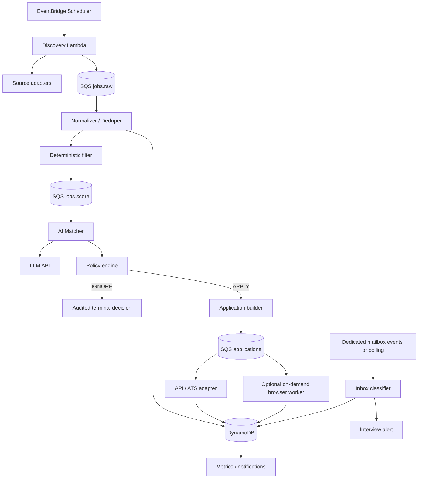
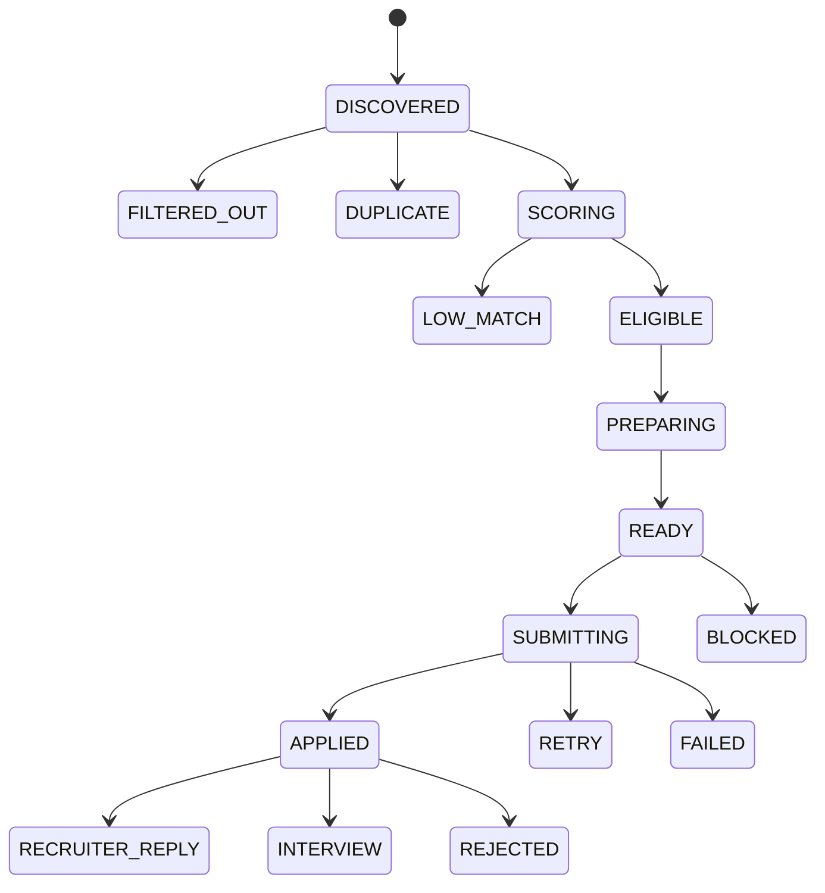

# AutoJob — Product Requirements & System Design

| Campo | Valor |
| --- | --- |
| Documento | PRD / SDD |
| Versão de origem | 1.0 |
| Status | Planejamento do MVP |
| Plataforma-alvo | AWS Serverless + GitHub + Codex |
| Modelo de entrega | Tasks incrementais gerenciadas no GitHub Projects |
| Papel deste arquivo | Especificação inicial e fonte de verdade versionada |

## 1. Visão executiva

AutoJob é uma plataforma autônoma de busca e candidatura a vagas. Ela descobre oportunidades continuamente, avalia aderência ao perfil do candidato, prepara materiais personalizados e verdadeiros, submete candidaturas por canais suportados, acompanha os estados e monitora respostas.

O objetivo norteador é:

> **Maximizar entrevistas qualificadas por unidade de custo.**

O MVP prioriza baixo custo operacional e mínima intervenção rotineira. Sua arquitetura é serverless e orientada a eventos: Lambda executa processamento e orquestração leves; SQS desacopla estágios; DynamoDB mantém estado; S3 armazena documentos; EventBridge agenda descoberta; workers conteinerizados de navegador só podem ser considerados quando um fluxo suportado realmente exigir execução em browser.

## 2. Princípios do produto

- Priorizar oportunidades de alta aderência, não volume bruto de candidaturas.
- Nunca fabricar informações sobre o candidato.
- Manter trilha completa de vagas, decisões, artefatos, submissões e respostas.
- Aprender com resultados para melhorar o ranking futuro.
- Permanecer barato o suficiente para uso pessoal contínuo.
- Operar com mínima interação rotineira, mas exigir ação humana diante de fatos ausentes, proteções externas ou decisões de emprego.

## 3. Escopo

### 3.1 Incluído no MVP

- Configuração do perfil e das preferências do candidato.
- Ingestão de vagas a partir de fontes públicas/aprovadas e integrações ATS.
- Normalização e deduplicação.
- Pré-filtro determinístico antes de qualquer chamada a LLM.
- Scoring e reasoning de aderência assistidos por IA.
- Motor de política de candidatura.
- Geração de currículo/conteúdo/respostas usando somente fatos verificados.
- Submissão por caminhos de integração suportados.
- Tracking de candidatura e idempotência.
- Classificação de respostas por e-mail para sinais de recrutador/entrevista.
- Métricas, logs, retentativas, DLQs e controles de custo.
- Entrega via GitHub Projects em tasks pequenas e adequadas ao limite diário do Codex.

### 3.2 Explicitamente fora do MVP

- Contornar CAPTCHA, MFA, anti-bot, rate limits, termos, controles de acesso ou restrições técnicas.
- Fabricar informações para satisfazer requisitos de uma vaga.
- Fazer candidaturas indiscriminadas sem threshold de aderência.
- Comparecer automaticamente a entrevistas ou personificar o candidato.
- Negociar ou aceitar ofertas e termos de emprego automaticamente.
- Operar como SaaS público multi-tenant.

## 4. Métricas de sucesso

| Métrica | Meta do MVP | Finalidade |
| --- | --- | --- |
| Taxa de candidaturas duplicadas | 0% | Operação idempotente |
| Claims não verdadeiras geradas | 0 | Requisito rígido de segurança |
| Vagas pré-filtradas sem LLM | >= 40% | Controle de custo |
| Cobertura de auditoria de candidaturas | 100% | Rastreabilidade |
| Falhas encaminhadas para retry/DLQ | 100% | Confiabilidade |
| Orçamento mensal de infraestrutura | Alertas rígidos configuráveis | Contenção de custo |
| Conversão em entrevista | Medida desde o primeiro dia | Alvo de otimização |

## 5. Configuração e conhecimento do candidato

Dados pessoais não podem ser hard-coded no repositório. O perfil deve ser fornecido por configuração estruturada e armazenamento seguro. Exemplo de shape inicial, sem dados reais:

```json
{
  "roles": ["DevOps Engineer", "Cloud Engineer"],
  "work_modes": ["remote"],
  "locations": ["Brazil", "Worldwide"],
  "minimum_match": 75,
  "auto_apply_match": 85,
  "salary_floor": null,
  "skills": [],
  "excluded_keywords": [],
  "languages": [],
  "portfolio": [],
  "resume_assets": []
}
```

O exemplo define apenas estrutura ilustrativa e não comprova fatos do candidato. Segredos, tokens, credenciais de APIs ou mailbox nunca podem ser commitados. Quando implementados, devem usar AWS Secrets Manager ou SSM Parameter Store e GitHub encrypted secrets conforme o contexto.

## 6. Requisitos funcionais

| ID | Requisito |
| --- | --- |
| FR-01 | **Job discovery:** executar buscas agendadas e ingerir vagas das fontes configuradas. |
| FR-02 | **Normalization:** transformar todo registro de origem no schema canônico `Job`. |
| FR-03 | **Deduplication:** detectar duplicatas por IDs da fonte, URLs canônicas e fingerprints de conteúdo. |
| FR-04 | **Pre-filter:** rejeitar incompatibilidades óbvias com regras determinísticas antes do scoring por LLM. |
| FR-05 | **AI match:** produzir score estruturado, pontos fortes, gaps, riscos e recomendação para vagas remanescentes. |
| FR-06 | **Policy decision:** decidir `IGNORE`, `QUEUE`, `APPLY` ou `BLOCKED` por thresholds e hard constraints. |
| FR-07 | **Tailoring:** gerar conteúdo de currículo e respostas específicas à vaga usando somente fatos do candidato. |
| FR-08 | **Submission:** adaptadores suportados submetem candidaturas e persistem evidência/status. |
| FR-09 | **Idempotency:** o mesmo par candidato/vaga nunca é submetido duas vezes, salvo reset explícito. |
| FR-10 | **Tracking:** manter lifecycle de `DISCOVERED` a `INTERVIEW`, `REJECTED` ou `FAILED`. |
| FR-11 | **Inbox classification:** classificar mensagens relevantes e associá-las a candidaturas quando possível. |
| FR-12 | **Notification:** eventos de alto valor, como convite para entrevista, geram notificação ao usuário. |
| FR-13 | **Feedback loop:** agregar resultados por role, fonte, empresa, faixa de score e variante de currículo. |
| FR-14 | **Budget controls:** expor limites diários/mensais configuráveis de processamento e gasto com IA. |

## 7. Requisitos não funcionais

- **Segurança:** menor privilégio, criptografia em repouso e trânsito, nenhum segredo em Git ou logs.
- **Confiabilidade:** filas com entrega pelo menos uma vez, consumidores idempotentes, backoff exponencial e DLQ.
- **Observabilidade:** logs JSON, correlation IDs, métricas e alarmes CloudWatch.
- **Custo:** serverless por padrão; container/browser somente sob demanda.
- **Manutenibilidade:** interfaces comuns para adaptadores; regras de negócio independentes de ATS.
- **Testabilidade:** unit tests para policy, normalização e dedupe; fixtures de integração por adaptador.
- **Conformidade:** respeitar termos, acessos e restrições; não contornar proteções.
- **Performance:** descoberta e matching assíncronos; sem requisito subsegundo.
- **Minimização de dados:** reter apenas o necessário para matching, candidatura e análise.

## 8. Arquitetura do sistema



O fluxo deve ser auditável de ponta a ponta. Cada estágio precisa propagar correlation ID e persistir mudanças críticas. Filas dão backpressure e isolamento; consumers devem assumir possível reentrega.

## 9. Componentes AWS

| Serviço | Responsabilidade de referência |
| --- | --- |
| Amazon EventBridge | Agendar descoberta e manutenção periódica. |
| AWS Lambda | Descoberta, normalização, filtros, orquestração de matching, policy e adaptadores leves. |
| Amazon SQS | Separar workloads de descoberta, scoring e candidatura; retry e backpressure. |
| Amazon DynamoDB | Estado primário de vagas, candidaturas, cursores e eventos de resultado. |
| Amazon S3 | Armazenamento versionado de currículos-base e artefatos gerados. |
| AWS Secrets Manager / SSM | Credenciais e configuração sensível. |
| Amazon CloudWatch | Logs, métricas, dashboards e alarmes. |
| Amazon SES | Notificações operacionais/entrevistas opcionais. |
| AWS Fargate ou equivalente | Worker sob demanda apenas para fluxo permitido que exija browser completo. |

O framework de IaC (CDK ou Terraform) e a modelagem física das tabelas permanecem decisões pendentes e devem ser registradas em ADR antes da implementação correspondente.

## 10. Modelo de domínio inicial

### `Job`

```text
job_id, source, source_job_id, canonical_url, company, title,
location, work_mode, salary, description, fingerprint,
discovered_at, status
```

### `MatchEvaluation`

```text
job_id, score, strengths[], gaps[], hard_blocks[], recommendation,
model, prompt_version, evaluated_at
```

### `Application`

```text
application_id, job_id, status, resume_variant, answers_artifact,
adapter, submitted_at, submission_reference, failure_reason
```

### `OutcomeEvent`

```text
application_id,
type: RECRUITER_REPLY | INTERVIEW | REJECTION | OTHER,
source_message_id, confidence, occurred_at
```

Esses campos definem o núcleo inicial; detalhes, validação, chaves e índices devem ser especificados nas tasks/ADRs próprias, sem inventar dados do candidato.

## 11. Máquina de estados da candidatura



Transições devem ser persistidas atomicamente quando possível. Adaptadores de submissão devem usar chave idempotente derivada do candidato e da identidade canônica da vaga. O mecanismo exato de reset explícito precisa ser definido antes de uso.

## 12. Design de IA

### 12.1 Estratégia de modelos

- Regras determinísticas cobrem exclusões, localização, salário mínimo, duplicidade e constraints obrigatórias.
- Um modelo de baixo custo faz o primeiro scoring semântico.
- Modelo mais forte só recebe vagas promissoras ou ambíguas.
- Respostas usam JSON estruturado e validado por schema.
- Prompt e modelo são versionados e registrados por avaliação.
- Avaliações podem ser cacheadas por fingerprint da vaga + versão do perfil.

### 12.2 Guardrail de veracidade

Material gerado pode reformular, priorizar e selecionar experiência verificada. Não pode adicionar fatos ausentes da base de conhecimento do candidato. Qualquer resposta que exija informação factual desconhecida deve ser marcada `UNSUPPORTED`, nunca inferida.

Meta obrigatória: zero claims não verdadeiras.

### 12.3 Exemplo inicial de scoring

```text
score =
  role_fit        * 0.25 +
  skill_fit       * 0.25 +
  experience_fit  * 0.20 +
  work_mode_fit   * 0.10 +
  location_fit    * 0.05 +
  compensation    * 0.05 +
  domain_fit      * 0.10
```

Hard blocks sempre prevalecem sobre o score. Os pesos são ponto de partida, não licença para alterar o requisito sem task/decisão documentada.

## 13. Estratégia de fontes e adaptadores

```ts
interface JobSource {
  discover(cursor?: string): Promise<RawJob[]>;
  normalize(raw: RawJob): Promise<Job>;
}

interface ApplicationAdapter {
  supports(job: Job): boolean;
  prepare(job: Job, candidate: Candidate): Promise<ApplicationPackage>;
  submit(pkg: ApplicationPackage): Promise<SubmissionResult>;
}
```

Prioridades:

1. Feeds oficiais/públicos, endpoints ATS e career pages que permitem acesso programático.
2. Ingestão de alertas por e-mail, quando útil.
3. Browser somente em fluxos compatíveis, permitidos e tecnicamente estáveis.

Fluxos protegidos ou não suportados recebem `BLOCKED`; o sistema não tenta bypass.

## 14. Detecção de e-mail e entrevista

- Monitorar mailbox ou label dedicada, não toda a caixa pessoal indiscriminadamente.
- Classificar remetente, assunto e corpo em recruiter reply, convite, rejeição, assessment, confirmação ou unrelated.
- Correlacionar por empresa/domínio, cargo, referência da candidatura e thread anterior.
- Em `INTERVIEW` de alta confiança, atualizar estado e emitir alerta conciso.
- Não aceitar horários de calendário ou termos de emprego automaticamente no MVP.

## 15. Segurança e privacidade

- Repositório GitHub privado.
- Proteção de `main`; PR obrigatório para mudanças de produção.
- GitHub Actions usa OIDC e roles AWS estritamente limitadas.
- Ambientes dev/prod separados ou, no mínimo, prefixos/configuração isolados.
- Currículos e PII criptografados em S3; criptografia DynamoDB habilitada.
- Segredos não entram em prompts, salvo necessidade estrita e aprovada.
- Logs redigem e-mails, tokens, cookies, senhas e conteúdo de currículos.
- CloudTrail é habilitado para auditoria de segurança/infra quando apropriado.
- Budgets e detecção de anomalia precedem execução autônoma.

## 16. Estrutura-alvo do repositório

```text
autojob/
├── AGENTS.md
├── README.md
├── docs/
│   ├── PRD-SDD.md
│   ├── ROADMAP.md
│   ├── TASKS.md
│   ├── ADR/
│   └── runbooks/
├── src/
│   ├── domain/
│   ├── sources/
│   ├── matching/
│   ├── applications/
│   ├── inbox/
│   ├── notifications/
│   └── shared/
├── infra/
│   ├── cdk/ ou terraform/
│   └── environments/
├── prompts/
│   ├── matcher/
│   └── application/
├── tests/
│   ├── unit/
│   ├── integration/
│   └── fixtures/
├── scripts/
└── .github/
    ├── workflows/
    └── ISSUE_TEMPLATE/
```

A árvore é alvo evolutivo. Diretórios só devem ser criados pela task que necessitar deles.

## 17. Modelo de entrega no GitHub Projects

Fluxo: `Backlog → Ready → In Progress → Review → Done`.

O funcionamento detalhado está em `GITHUB-PROJECT.md`. Somente tasks sem dependências pendentes podem entrar em `Ready`, que deve conter de uma a três opções. Cada sessão do Codex trabalha preferencialmente em uma única Issue e não inicia outra automaticamente ao terminar.

Campos de issue:

- Epic/fase;
- prioridade `P0`, `P1` ou `P2`;
- tipo `Feature`, `Infra`, `Test`, `Docs`, `Bug` ou `Security`;
- tamanho `XS`, `S`, `M` ou `L`, preferindo `XS/S`;
- dependências;
- critérios de aceite;
- comando/evidência de verificação.

### Definition of Done

- Critérios de aceite atendidos.
- Testes automatizados adicionados/atualizados e aprovados.
- Lint e typecheck aprovados.
- Nenhum segredo ou dado pessoal commitado.
- Documentação atualizada quando comportamento/configuração mudar.
- Recursos cloud reproduzíveis por IaC.
- PR registra evidência de testes e rollback para mudanças de infraestrutura.

Uma task que não caiba, com testes e revisão, em uma sessão focada deve ser dividida antes de ir para `Ready`.

## 18. Roadmap de épicos

| Epic | Nome | Resultado resumido |
| --- | --- | --- |
| E0 | Repository foundation | Estrutura, TypeScript, testes, lint, instruções, CI e templates. |
| E1 | AWS foundation | IaC para dados, filas, artefatos, schedules, IAM, logs e custos. |
| E2 | Candidate knowledge base | Perfil, preferências, metadados, validação e versionamento. |
| E3 | Job domain & persistence | Job canônico, repositórios, fingerprint, estados e idempotência. |
| E4 | First discovery source | Uma fonte confiável de ponta a ponta. |
| E5 | Filtering & matching | Regras, scoring estruturado, prompts e telemetria. |
| E6 | Application package generator | Conteúdo, respostas, veracidade e artefatos. |
| E7 | First submission adapter | Um canal suportado, retries e auditoria. |
| E8 | Inbox & interview detection | Ingestão, classificação, correlação e alertas. |
| E9 | Metrics & optimization | Conversão, scorecards, custos e operação. |
| E10 | Additional sources/adapters | Expansão unitária baseada em evidência. |
| E11 | Browser worker | Worker opcional e sob demanda, se justificado. |

Dependências e ordem recomendada estão em `ROADMAP.md`; tasks executáveis estão em `TASKS.md`.

## 19. Contrato de uma task Codex

Cada issue deve declarar contexto, um único objetivo, escopo incluído, itens fora de escopo, critérios observáveis, verificação, dependências e notas de segurança/custo. A task atual limita a autorização: trabalho adjacente não é implícito.

## 20. CI/CD

- PR: instalação determinística, lint, typecheck, unit tests e validação/synth de infraestrutura.
- `main`: deploy automático em dev somente após CI e quando autorizado por task futura.
- Produção: aprovação manual inicial; deploy autônomo não é requisito do MVP.
- OIDC assume roles AWS de escopo mínimo.
- Aplicação e infraestrutura devem ser independentemente implantáveis quando prático.

## 21. Controles de custo

- Filtrar antes de LLM.
- Agrupar ou cachear avaliações quando seguro.
- Usar fingerprints para não reprocessar vagas.
- Preferir Lambda em computação curta.
- Manter browser workers desligados e encerrá-los após o job.
- Configurar AWS Budgets e alarmes antes de habilitar schedules.
- Medir custo de LLM por vaga, candidatura e entrevista.
- Disponibilizar kill switch que pause schedules sem destruir estado.

## 22. Tratamento de falhas

| Falha | Comportamento esperado |
| --- | --- |
| Erro transitório de fonte/API | Retry com backoff exponencial. |
| Payload malformado | Quarentena com motivo e fixture para teste futuro. |
| Falha de schema da LLM | Uma tentativa de reparo; depois, DLQ. |
| Submissão incerta | Reconciliar antes de retry; nunca repetir cegamente. |
| Credencial expirada, MFA, CAPTCHA ou proteção | Marcar `BLOCKED` e alertar; não contornar. |
| Limite de orçamento atingido | Parar processamento opcional e preservar fila/estado. |

## 23. Critérios de release do MVP

- Ao menos uma fonte opera de ponta a ponta.
- Vagas são normalizadas, deduplicadas, filtradas e avaliadas.
- Ao menos um canal suportado submete e registra candidatura.
- Testes de integração não produzem submissão duplicada.
- Conteúdo gerado passa por verificação de veracidade.
- Detecção de recruiter/interview passa contra fixtures.
- Alarmes, DLQ e guardrails de orçamento estão ativos.
- Runbook cobre pause/resume, rotação de segredos, recuperação e rollback.
- Sistema opera sete dias sem intervenção rotineira, exceto eventos externos de autenticação/proteção.

## 24. Pós-MVP

- Adaptadores ATS/fontes adicionais.
- Ranking específico por role/fonte baseado em conversão.
- Teste A/B de currículo.
- Qualidade/reputação de empresas.
- Normalização salarial entre moedas.
- Outreach separado e controlado por política.
- Dashboard completo de candidaturas, respostas, entrevistas e custo.
- Thresholds adaptativos por conversão em entrevista.

## 25. Decisões arquiteturais de referência

| ADR | Decisão | Razão |
| --- | --- | --- |
| ADR-001 | Arquitetura AWS serverless-first | Minimizar custo ocioso e overhead operacional. |
| ADR-002 | DynamoDB antes de banco relacional | Workload inicialmente baixo, orientado a estado/evento. |
| ADR-003 | Filas entre estágios | Retry, throttling e scaling independentes. |
| ADR-004 | Filtro determinístico antes de LLM | Reduz custo e aumenta explicabilidade. |
| ADR-005 | Browser worker opcional | Não tornar automação frágil uma dependência central. |
| ADR-006 | Issues como unidades de trabalho Codex | Suportar entrega incremental sob limite diário. |
| ADR-007 | Veracidade como hard constraint | Conversão não pode resultar de claims falsos. |

Essas decisões vieram da especificação v1.0. ADRs versionados futuros podem detalhá-las; mudanças exigem decisão explícita e atualização desta fonte de verdade.

## 26. Primeiro milestone recomendado

Não começar automatizando todos os job boards. O primeiro milestone prova o pipeline completo com uma fonte e um canal suportados:

```text
discover → normalize → dedupe → filter → score → prepare
→ submit → persist → detect response
```

Condição de saída: um fluxo autônomo no ambiente AWS dev, com testes, auditoria, custo medido e kill switch. Só depois fontes adicionais se tornam novos adaptadores, e não novas arquiteturas.

## 27. Questões arquiteturais em aberto

As seguintes escolhas foram deixadas intencionalmente para ADR/tasks específicas:

- CDK ou Terraform como framework de IaC.
- Gerenciador de pacotes, test runner e formatter concretos do workspace TypeScript.
- Primeira fonte de vagas permitida e seus termos/contrato técnico.
- Primeiro canal de submissão suportado e estratégia de ambiente de teste.
- Modelagem física, chaves, índices e política de retenção no DynamoDB.
- Provedor/modelos de IA, limites de escalonamento e orçamento inicial.
- Provedor de mailbox/notificação e fluxo de autorização.
- Critério quantitativo que justificaria o Epic E11 browser worker.
- Definição segura de reset explícito de idempotência.
- Limites de confiança para classificação/correlação e quando exigir revisão humana.

Nenhuma dessas pendências autoriza antecipar implementação; cada uma deve ser resolvida no momento indicado pelo roadmap.
